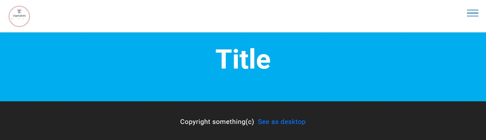
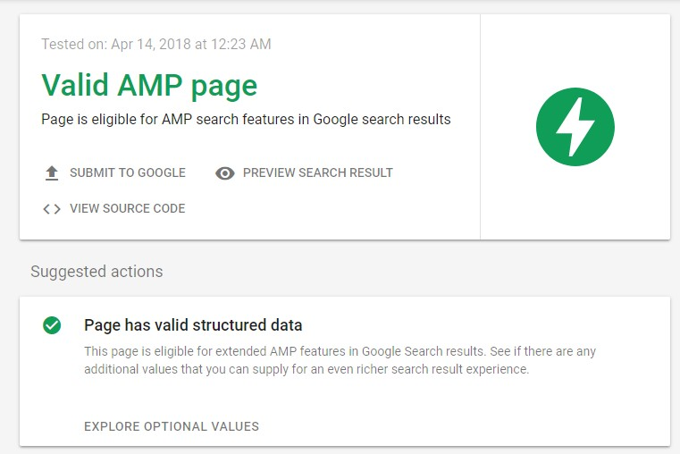

# AMPGeneratorOne
The library generates Google AMP sites using PHP by using procedural code.

[](https://travis-ci.org/EFTEC/AMPGeneratorOne)
[](https://packagist.org/packages/eftec/amp-generator-one)
[](https://packagist.org/packages/eftec/amp-generator-one)
[]()
[]()
[]()
[]()
[]()

- [AMPGeneratorOne](#ampgeneratorone)
  * [How it works?](#how-it-works-)
  * [Validity](#validity)
  * [Version](#version)
  * [Example demo:](#example-demo-)


This application simplifies (via code) the generation of an AMP site.  It's easiest to program, just a few of lines of code and that's it.

For example, let's say that you want to add a new section
```php 
$secImage= new SectionModel("The Cupcakes","","/image.jpg");
$secImage->buttons[]=new ButtonModel("More Information","#");
$secImage->buttons[]=new ButtonModel("More Information","#","warning");

$amp->sectionImage($secImage,2250,441);
```
It will generate the next visual:


## How it works?

```php 
use eftec\AmpGeneratorOne\AmpGeneratorOne;
use eftec\AmpGeneratorOne\ButtonModel;
use eftec\AmpGeneratorOne\FooterModel;
use eftec\AmpGeneratorOne\HeaderModel;
use eftec\AmpGeneratorOne\HeadModel;
use eftec\AmpGeneratorOne\LinkModel;
use eftec\AmpGeneratorOne\SectionModel;

include "lib/AmpGeneratorOne.php";
$amp=new AmpGeneratorOne("https://www.canonical.com","https://www.canonical.com/amp");
// # 
$amp->startAmp(new HeaderModel("description","title","favicon.ico"));

// # sidebar (optional)
$amp->sidebar($menu); // $menu is an array of /LinkModel()

// #1 head (the top bar)
$amp->head(new HeadModel("",$base."logo.png"),70,70);

// # example section
$amp->sectionFirst(new SectionModel("Title","Description"));

// # footer
$amp->sectionFooter(new FooterModel("Copyright something(c)","See as desktop"));

amp->render(); // you also could generate a file.
```



Tablet version


Mobile version

.jpg)

Mobile version (slider open)

## Method __construct
AmpGeneratorOne constructor.

### Parameters:  
* **$canonical** Original url . Example https://www.southprojects.com/somesite (string)
* **$base** Original base url without trailing slash. Example https://www.southprojects.com (string)
* **$sidebarColor** The background color of the sidebar Example #ffffff,white,rgb(255,255,255) (string)
* **$themecolor** .The color of the logo,burger Example #ffffff,white,rgb(255,255,255) (string)
* **$classSidebar.** text-primary,text-secondary,text-success,text-info,text-warning,text-danger,text-white,text-black (string)
## Method fixRelativeUrl
Fix an url and convert a relative url into an absolute url

### Parameters:  
* **$url** param $url ()
```php
$tmp=$ampgeneratorone->fixRelativeUrlthis(); 
```
## Method genStructured
It generates the social and seo structure (Twitter card, Facebook OG and Google Schema)

### Parameters:  
* **$structured** param StructureModel $structured (StructureModel)
```php
$tmp=$ampgeneratorone->genStructuredthis(); 
```
## Method startAmp
Start to generate an Amp site.

### Parameters:  
* **$param** param HeaderModel $param (HeaderModel)
* **$structured** param StructureModel $structured (StructureModel)
## Method sidebar
Generates a sidebar.

### Parameters:  
* **$urls** param LinkModel[] $urls (LinkModel[])
```php
$tmp=$ampgeneratorone->sidebarthis(); 
```
## Method head
Generates the header navigation

### Parameters:  
* **$param** param HeadModel $param (HeadModel)
* **$width** param int $width (int)
* **$height** param int $height (int)
```php
$tmp=$ampgeneratorone->headthis(); 
```
## Method sectionFooter
It generates a footer of the amp site.

### Parameters:  
* **$param** param FooterModel $param (FooterModel)
```php
$tmp=$ampgeneratorone->sectionFooterthis(); 
```
## Method sectionAnalytics
Generates a Google Analytics section

### Parameters:  
* **$account** UA-XXXXX-Y (string)
```php
HeaderModel());
```
```php
$tmp=$ampgeneratorone->sectionAnalyticsthis(); 
```
## Method sectionFirst
It draw a first section (hero style)

### Parameters:  
* **$content** param SectionModel $content (SectionModel)
```php
$tmp=$ampgeneratorone->sectionFirstthis(); 
```
## Method sectionImageButton
It generates a section with a single button.

### Parameters:  
* **$content** param SectionModel $content (SectionModel)
* **$fullscreen** param bool $fullscreen (bool)
```php
$tmp=$ampgeneratorone->sectionImageButtonthis(); 
```
## Method sectionText
It generates a section with a text.

### Parameters:  
* **$content** param SectionModel $content (SectionModel)
```php
$tmp=$ampgeneratorone->sectionTextthis(); 
```
## Method sectionTextQuote
It generates a quote text

### Parameters:  
* **$content** param SectionModel $content (SectionModel)
```php
$tmp=$ampgeneratorone->sectionTextQuotethis(); 
```
## Method sectionUL
It generates an unsorted list section

### Parameters:  
* **$links** param LinkModel[] $links (LinkModel[])
```php
$tmp=$ampgeneratorone->sectionULthis(); 
```
## Method sectionOL
It generates a sorted list section

### Parameters:  
* **$links** param LinkModel[] $links (LinkModel[])
```php
$tmp=$ampgeneratorone->sectionOLthis(); 
```
## Method sectionButtons
It generates a section with one (or more than one) buttons.

### Parameters:  
* **$content** param SectionModel $content (SectionModel)
```php
$tmp=$ampgeneratorone->sectionButtonsthis(); 
```
## Method sectionCols
It generates a section with columns

### Parameters:  
* **$contents** param SectionModel[] $contents (SectionModel[])
```php
$tmp=$ampgeneratorone->sectionColsthis(); 
```
## Method sectionHeaderCentral
It generates a header central section. It could includes buttons.

### Parameters:  
* **$content** param SectionModel $content (SectionModel)
```php
$tmp=$ampgeneratorone->sectionHeaderCentralthis(); 
```
## Method sectionRaw


### Parameters:  
## Method sectionImageContent
It generates a section with an image content.

### Parameters:  
* **$content** param SectionModel $content (SectionModel)
* **$width** param $width ()
* **$height** param $height ()
```php
$tmp=$ampgeneratorone->sectionImageContentthis(); 
```
## Method sectionImageContentLeft
It generates a section with a image content at the left.

### Parameters:  
* **$content** param SectionModel $content (SectionModel)
* **$width** param $width ()
* **$height** param $height ()
```php
$tmp=$ampgeneratorone->sectionImageContentLeftthis(); 
```
## Method sectionTable
It generates a table

### Parameters:  
* **$cols** param array $cols (array)
```php
$tmp=$ampgeneratorone->sectionTablethis(); 
```
## Method sectionImage
It generates an image. The size of the image is required to calculate the ratio

### Parameters:  
* **$content** param SectionModel $content (SectionModel)
* **$width** param int $width (int)
* **$height** param int $height (int)
```php
$tmp=$ampgeneratorone->sectionImagethis(); 
```
## Method sectionGMapFull
It generates a google map section. It can't be locate at the 30% top of the site (Amp restriction)

### Parameters:  
* **$content** param SectionModel $content (SectionModel)
* **$googleMapUrl** param string $googleMapUrl (string)
* **$placeholder** param string $placeholder (string)
```php
$tmp=$ampgeneratorone->sectionGMapFullthis(); 
```
## Method sectionGMapBoxed
It generates a google map (boxed) section. It can't be locate at the 30% top of the site (Amp restriction)

### Parameters:  
* **$content** param SectionModel $content (SectionModel)
* **$googleMapUrl** param string $googleMapUrl (string)
```php
$tmp=$ampgeneratorone->sectionGMapBoxedthis(); 
```
## Method sectionNavigation
It generates a footer navigation

### Parameters:  
* **$content** param SectionModel $content (SectionModel)
* **$image** param string $image (string)
* **$width** param int $width (int)
* **$height** param int $height (int)
* **$navCol1** param LinkModel[] $navCol1 (LinkModel[])
* **$navCol2** param LinkModel[] $navCol2 (LinkModel[])
* **$navCol3** param LinkModel[] $navCol3 (LinkModel[])
* **$navCol4** param LinkModel[] $navCol4 (LinkModel[])
```php
$tmp=$ampgeneratorone->sectionNavigationthis(); 
```
## Method sectionColImage
It generates a section with images and text.

### Parameters:  
* **$contents** param SectionModel[] $contents (SectionModel[])
* **$width** param int $width (int)
* **$height** param int $height (int)
* **$maxCol** param int $maxCol (int)
```php
$tmp=$ampgeneratorone->sectionColImagethis(); 
```
## Method genModifyStyle


### Parameters:  
## Method setBackgroundColor
Fluent operation, it changes the background color of the next section

### Parameters:  
* **$color** Example #ffffff,rgb(30,30,30),white (string)
```php
$tmp=$ampgeneratorone->setBackgroundColorthis(); 
```
## Method setBgImage
Fluent operation, it changes the background image of the next section

### Parameters:  
* **$bgImage** param string $bgImage (string)
```php
$tmp=$ampgeneratorone->setBgImagethis(); 
```
## Method setClassTextColor
Fluent operation, it sets the class of the text

### Parameters:  
* **$class** text-primary,text-secondary,text-success,text-info,text-warning,text-danger,text-white,text-black (string)
```php
$tmp=$ampgeneratorone->setClassTextColorthis(); 
```
## Method setPadding
Fluent operation, it changes the padding

### Parameters:  
* **$top** param $top ()
* **$bottom** param $bottom ()
```php
$tmp=$ampgeneratorone->setPaddingthis(); 
```
## Method resetDefault


### Parameters:  
## Method setDefault
It reset to the default background color and text class

### Parameters:  
* **$backGroundColor** Example #ffffff,rgb(30,30,30),white (string)
* **$classTextColor**  text-primary,text-secondary,text-success,text-info,text-warning,text-danger,text-white,text-black (string)
## Method image


### Parameters:  
## Method table


### Parameters:  
## Method render
It renders the result page.

### Parameters:  
## Method renderToFile
It renders the result to file

### Parameters:  
* **$filename** param string $filename (string)
## Method genLink
Generate the first link of an array only if array constains information or the link is not empty.

### Parameters:  
* **$url** param LinkModel|LinkModel[] $url (LinkModel|LinkModel[])
```php
$tmp=$ampgeneratorone->genLinkthis(); 
```
## Method genButton
Generate the first link of an array only if array constains information or the link is not empty.

### Parameters:  
* **$url** param ButtonModel|ButtonModel[] $url (ButtonModel|ButtonModel[])


> Note: You could change the color. **!**

## Validity

You could validate your amp on [Google search validation](https://search.google.com/test/amp)



## Version

* 1.3 2018-11-03 Added Phpunit and travis.
* 1.1 2018-09-20 Fixed some bugs.
* 1.0 2018-09-08 First non beta version
* 0.3 2018-09-07 Cleaning the house.
* 0.2 2018-09-06 Working version.
* 0.1 2018-08-20 First prototype


## Example demo:
             
[See end result](http://htmlpreview.github.io/?https://raw.githubusercontent.com/EFTEC/AMPGeneratorOne/master/example/example-generated.html)

